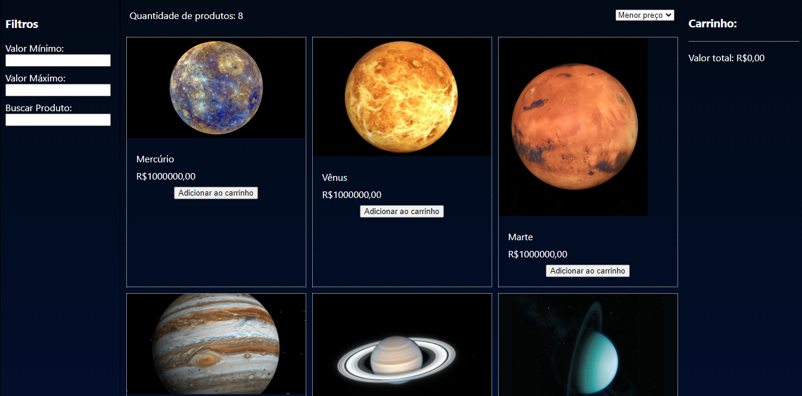

<h1 align=center>

 🚀 Labe Commerce 🌍 <br>


</h1>

---

## 📝️ Sobre
Primeiro projeto em grupo de Frontend da Labenu. A ideia foi desenvolver uma loja online, onde o usuário pode adicionar e remover ítens do carrinho, filtrar os produtos por menor/maior preço e buscar os produtos por nome e valores.

---

## 🖥 Link do Surge
<h3>
<a href="http://oafish-design.surge.sh/" target="_blank">Acessar: LabeCommerce</a>
</h3>


---

## 🚀️ Telas



---

### 🚀️ Tecnologias utilizadas

- ReactJS
- Styled-components

---

### Futuras Melhorias

- Alterações no css
- Botão para abrir carrinho

---

### 💾️ Como baixar/testar o projeto

- Você irá precisar instalar o [Git](https://git-scm.com/), [NodeJS](https://nodejs.org/pt-br/download/) + [Visual Studio code](https://code.visualstudio.com/).

```bash
# Versões mínimas ou superiores.
$ node -v
v12.19.0

$ npm -v
6.14.5
```

- Para configurar, no bash digite os seguinte códigos:

```bash
# Clonar o repositório
$ git clone https://github.com/future4code/dumont-labe-commerce11.git

#Entrar no diretório
$ cd dumont-labe-commerce11

#Abrir projeto no VsCode ou com seu prompt de comando de preferência
code . ||  cd dumont-labe-commerce11 (Passo acima) 

#Com o terminal aberto rodar o comando
$ npm install (para instalar as dependências necessárias)

#Agora só rodar o projeto com o comando
$ npm start

#Pronto projeto abrirá em seu navegador padrão
Agora é só testar em seu navegador!

```
---

### Desenvolvido com 💜 por

<a href="https://www.linkedin.com/in/bianca-cmendes/" target="_blank">***Bianca Mendes***</a>
<br/> 
***Kelly Knoblauch***
<br/> 
<a href="https://www.linkedin.com/in/azzinogueiramarina/" target="_blank">***Marina Azzi***</a>
<br/> 


### Licença

Este projeto está licenciado sob a licença MIT - consulte a página [LICENSE](https://opensource.org/licenses/MIT) para obter detalhes.


